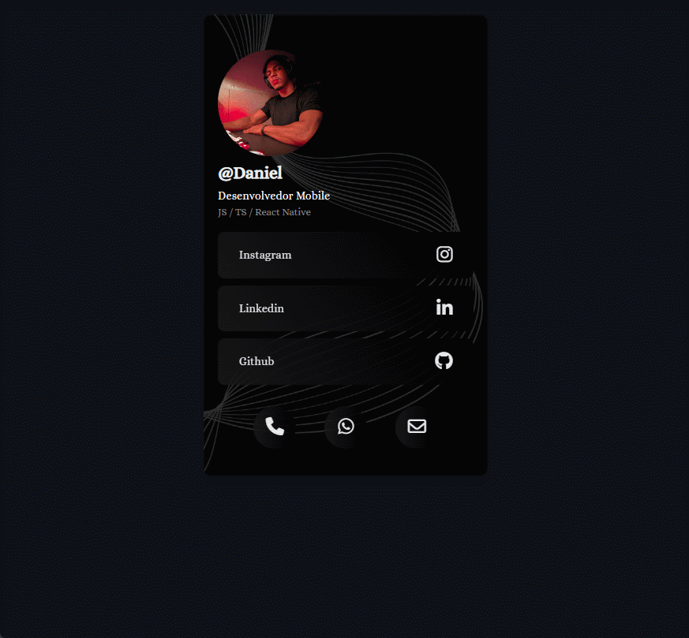

<div align="center">
  
</div>

<h1 align='center'>
 <p>My Social Links</p>
</h1>

### 📕 About

Social Links Digital Card

<div align="center">
  
</div>


#

### ❓ Why the app

Card created to practice my CSS skills

#


### ⛏️ Tools used

- [HTML](https://developer.mozilla.org/en-US/docs/Web/HTML)
- [CSS](https://developer.mozilla.org/pt-BR/docs/Web/CSS)
- [JavaScript](https://developer.mozilla.org/pt-BR/docs/Web/JavaScript)

#

### 🤝🏽 How to contribute

You need to have [Node](https://nodejs.org/en/download), [Git](https://git-scm.com/download/win) and [VsCode](https://code.visualstudio.com/download) installed on your computer.


#### Follow the step by step

````bash
    # Clone the project
    $ git clone git@github.com:dan-ia/My-Social-Links.git

    # Enter directory
    $ cd My-Social-Links

    # Open project in VsCode
    code .
````
<div align="center">

<br>

<h3> Any questions? Contact me! 🩵✌️</h3>

[](https://www.linkedin.com/in/dan-ia/)
[](mailto:danieillsilvarv411@gmail.com)


</div>

